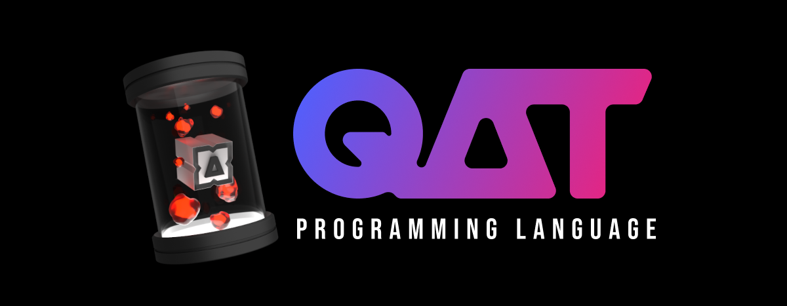

<div>
<a href="https://opencollective.com/qatlang"></a>
<a href="https://buymeacoffee.com/aldrinmathew"></a>
<a href="https://ko-fi.com/aldrinmathew"></a>
<a href="https://paypal.me/aldrinsartfactory"></a>
</div>



<div>
<a href="https://qatlang.org"></a>
<a href="https://youtube.com/@aldrinmathew"></a>
<a href="https://discord.gg/CNW3Uvptvd"></a>
<a href="https://reddit.com/r/qatlang"></a>
<a href="https://github.com/AldrinMathew"></a>
<hr>
</div>

**qat** is closer to your machine's heart. A superfast, modern systems language for reliable & maintainable code...

### Focus-points of `qat`

- Changes in data are obvious by design
- Advanced compile-time execution & configuration
- Safe pointer types
- Built-in memory management features
- Expressive & flexible syntax
- Simplistic approach to systems programming
- Modular & customisable build process

If you are facing issues with the language, [create an issue](https://github.com/qatlang/qat/issues/new/choose).

### Building the project

Requirements:

- CMake 3.16.3 minimum - Latest recommended
- LLVM 19 (llvm + lld + clang) - Static libraries
- Boost 1.86 (Boost.Filesystem) - Static libraries

Make sure that the LLVM & Boost builds are in release mode, if you are building those yourself.

```bash
cmake -DCMAKE_INSTALL_PREFIX="${HOME}/dev/qat" -DCMAKE_BUILD_TYPE=Release -DLLVM_DIR="/path/to/llvm" -DCMAKE_CXX_COMPILER="clang++-19" -DBOOST_DIR="/path/to/boost" -DCMAKE_C_COMPILER="clang-19" -DCMAKE_C_COMPILER_WORKS=1 -DCMAKE_CXX_COMPILER_WORKS=1 -DBUILD_SHARED_LIBS=false -GNinja -S src/ -B build/
cmake --build build --config Release --target install
```

The above command installs the language in the directory `${HOME}/dev/qat`, which is the recommended installation path for unix-like systems. Feel free to make changes to the above configuration to suit your needs.

### License

This project is published under the [**Public Source Licence**](https://github.com/qatlang/qat/blob/main/LICENSE) and is solely maintained by [Aldrin Mathew](https://github.com/AldrinMathew).
